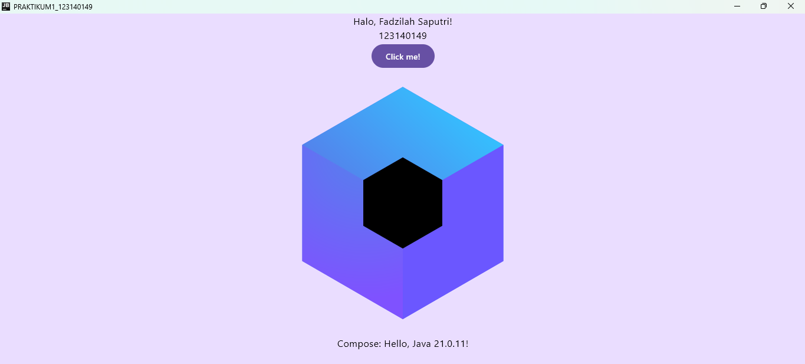
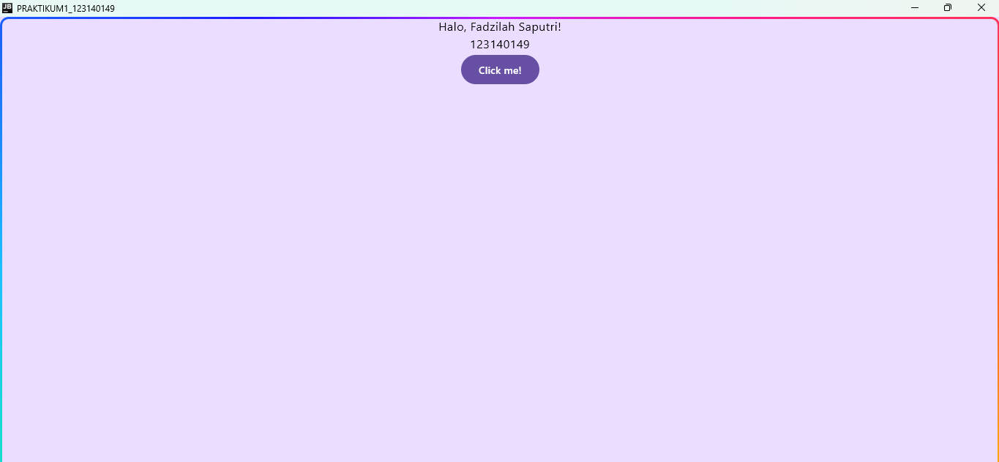

# Tugas Praktikum Minggu 1 - Pengembangan Aplikasi Mobile

**Nama:** Fadzilah Saputri

**NIM:** 123140149

**Program Studi:** Teknik Informatika

**Mata Kuliah:** Pengembangan Aplikasi Mobile

---

## Deskripsi Singkat
Proyek ini merupakan implementasi awal aplikasi multiplatform menggunakan **Kotlin Multiplatform (Compose Multiplatform)**. Aplikasi dimodifikasi untuk menampilkan salam, identitas mahasiswa (Nama dan NIM), serta mendeteksi nama platform target yang sedang aktif saat tombol ditekan.

---

## Hasil Eksekusi Aplikasi

