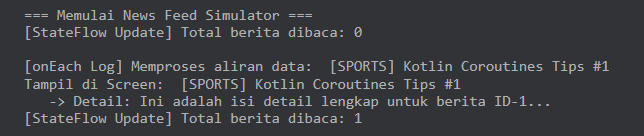
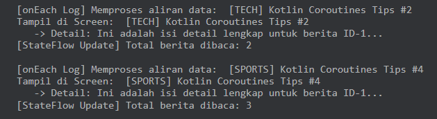
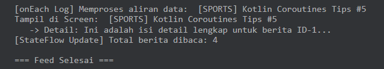

# Tugas Praktikum 2 - News Feed Simulator

**Fadzilah Saputri - 123140149 - PAM RA**

##  Deskripsi Tugas
Tugas ini bertujuan untuk membangun simulasi aplikasi **News Feed Simulator** menggunakan bahasa pemograman Kotlin. Aplikasi ini mendemonstrasikan penanganan data asynchronous dan pemrograman reaktif dengan memanfaatkan fitur **Kotlin Coroutines**, **Flow**, dan **StateFlow**.

---

##  Tujuan Pembelajaran
Tugas ini dibuat untuk memenuhi kriteria praktikum dengan mempelajari dan mengimplementasikan konsep-konsep berikut:
1. **Asynchronous Stream (Flow)**: Simulating real-time data emission dengan jeda waktu tertentu.
2. **Flow Operators**: Mengolah dan memanipulasi aliran data menggunakan operator `.filter` dan `.map`.
3. **State Management (StateFlow)**: Menyimpan dan memantau perubahan status data (state) aplikasi secara reaktif.
4. **Concurrency (Coroutines)**: Menjalankan eksekusi kode secara bersamaan (paralel/asynchronous) menggunakan `async` dan `await`.

---

##   Fitur dan Implementasi Kode
1. **Simulasi Feed Berita 2 Detik**: Menggunakan `Flow` yang memancarkan data berita baru setiap 2 detik (`delay(2000)`).
2. **Filter Kategori Berita**: Menyaring berita yang masuk berdasarkan kategori tertentu menggunakan operator `.filter`.
3. **Transformasi Format Tampilan**: Mengubah objek berita menjadi format teks yang siap ditampilkan menggunakan operator `.map`.
4. **Penghitung Berita Dibaca (StateFlow)**: Menyimpan jumlah berita yang telah dibaca menggunakan `MutableStateFlow` dan diekspos secara read-only via `StateFlow`.
5. **Pengambilan Detail Berita Async**: Simulasi *fetching* detail isi berita secara asynchronous menggunakan `async` dan `await()`.

---

##  Hasil Eksekusi Program (Output)

