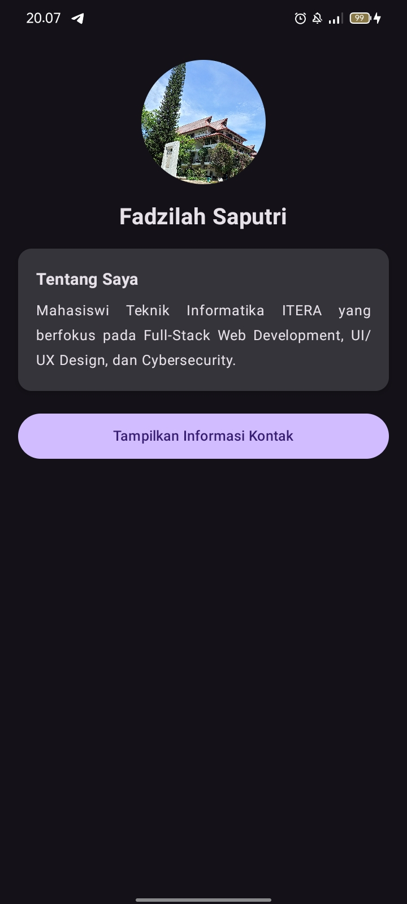

# My Profile App - Praktikum 3

Aplikasi profil interaktif berbasis Android yang dibangun menggunakan **Jetpack Compose**. Proyek ini merupakan tugas Praktikum 3 yang berfokus pada implementasi UI modern, pembuatan komponen *reusable*, dan manajemen *state* pada aplikasi Android.

##  Fitur Utama
* **Profile Header:** Menampilkan foto profil melingkar (*Circle Cropped*) dan nama pengguna.
* **Bio Card:** Kartu deskripsi singkat tentang fokus minat pengembangan (Full-Stack, UI/UX, dan Cybersecurity).
* **Interactive Contact Toggle:** Tombol interaktif untuk menampilkan atau menyembunyikan informasi detail.
* **Animated Visibility (Bonus):** Animasi transisi `fadeIn` dan `fadeOut` yang mulus saat memunculkan kartu informasi kontak (Email, Nomor HP, dan Lokasi).
* **Dark Mode Support:** Antarmuka otomatis beradaptasi dengan tema gelap/terang dari sistem perangkat.

##  Teknologi yang Digunakan
* **Kotlin**
* **Jetpack Compose** (UI Toolkit)
* **Material Design 3** (Material Icons Extended)
* **Android Studio**

##  Tangkapan Layar (Screenshots)

